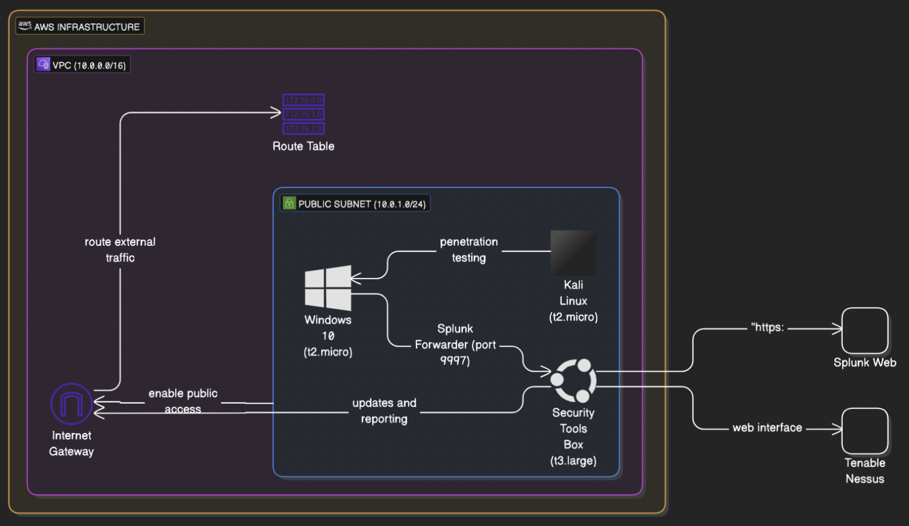

# AWS Cybersecurity Homelab for Real-Time Monitoring

[](https://www.terraform.io/)

☁️ **Cloud Cybersecurity Homelab**

Attack/defend lab on AWS with:

* **Kali Linux** for penetration testing
* **Windows Server 2019** as attack target
* **Security Tools Box (Ubuntu)** running Splunk Enterprise & Nessus Essentials

All infrastructure defined in Terraform for reproducibility, security, and scalability.

---

## Table of Contents

1. [Topology](#topology)
2. [Architecture Overview](#architecture-overview)
3. [Prerequisites](#prerequisites)
4. [Repository Structure](#repository-structure)
5. [Getting Started](#getting-started)
6. [Instance Configuration](#instance-configuration)
7. [Tool Installation & Configuration](#tool-installation--configuration)
8. [Cleanup](#cleanup)
9. [Best Practices](#best-practices)
10. [Security Considerations](#security-considerations)
11. [Next Steps & Enhancements](#next-steps--enhancements)
12. [Resources](#resources)

---

## Topology



Single public VPC containing three EC2 hosts in a public subnet, each secured by its own security group.

---

## Architecture Overview

* **VPC**: 10.0.0.0/16
* **Public Subnet**: 10.0.1.0/24
* **Internet Gateway & Route**: 0.0.0.0/0 → IGW
* **Security Groups**

  * **Win/Kali SG**: SSH (22), RDP (3389), ICMP
  * **Tools SG**: SSH (22), Splunk (8000/9997), Nessus (8834), ICMP
* **EC2 Instances**

  1. **windows**: Windows Server 2019 (t3.medium)
  2. **kali**: Kali Linux (t3.small)
  3. **tools**: Ubuntu 20.04 (t3.large)

---

## Prerequisites

* **AWS account** with EC2, VPC, IAM permissions
* **AWS CLI** (run `aws configure`)
* **Terraform** >= 1.5.0
* **SSH client** (OpenSSH or PuTTY)
* **RDP client** (Microsoft Remote Desktop)

---

## Repository Structure

```text
.
├── images/               # Architecture diagram
├── scripts/              # Post-launch scripts
│   ├── kali_setup.sh     # Kali user_data script
│   ├── nessus_install.sh
│   └── splunk_inputs.conf
├── terraform/            # Terraform config
│   ├── provider.tf
│   ├── variables.tf
│   ├── main.tf
│   └── outputs.tf
└── README.md             # This file
```

---

## Getting Started

### 1. Clone the repo

```bash
git clone https://github.com/r-ramos2/scalable-aws-cybersecurity-lab-for-real-time-monitoring-and-vulnerability-management.git
cd scalable-aws-cybersecurity-lab-for-real-time-monitoring-and-vulnerability-management/terraform
```

### 2. Generate SSH key locally

```bash
ssh-keygen -t rsa -b 4096 -f ~/.ssh/cyberlab_deployer -N ""
```
⚠️ Important: Update `allowed_cidr` with your current public IP (with `/32` mask) before applying.

Then set absolute path to the public key in `terraform.tfvars`:

```ini
public_key_path = "/home/youruser/.ssh/cyberlab_deployer.pub"
allowed_cidr    = "203.0.113.25/32" # your home IP
```

### 3. Configure AWS & Terraform

```bash
terraform init
terraform validate
terraform plan -out=plan.tf
terraform apply plan.tf
```

On success you’ll see outputs for key name and public IPs.

---

## Instance Configuration

### Kali Linux

```bash
ssh -i ~/.ssh/cyberlab_deployer kali@<KALI_PUBLIC_IP>
```

Kali is configured via `scripts/kali_setup.sh` (XFCE desktop + XRDP).

### Windows Server 2019

1. Retrieve Administrator password from AWS Console.
2. RDP to `RDP://<WINDOWS_PUBLIC_IP>`.

### Security Tools Box (Ubuntu)

```bash
ssh -i ~/.ssh/cyberlab_deployer ubuntu@<TOOLS_PUBLIC_IP>
```

To install Nessus:

```bash
bash ../scripts/nessus_install.sh
```

---

## Tool Installation & Configuration

### Splunk Enterprise

```bash
wget -O splunk.deb https://download.splunk.com/releases/9.1.0/linux/splunk.deb
sudo dpkg -i splunk.deb
sudo /opt/splunk/bin/splunk start --accept-license --answer-yes
```

* UI: `http://<TOOLS_PUBLIC_IP>:8000`
* Forwarder port: 9997

### Tenable Nessus Essentials

```bash
bash ../scripts/nessus_install.sh
```

UI: `https://<TOOLS_PUBLIC_IP>:8834`

---

## Cleanup

```bash
cd terraform
terraform destroy -auto-approve
```

---

## Best Practices

* Least-privilege IAM
* Restrict SG ingress to your CIDR
* Rotate SSH keys regularly
* Enable CloudTrail & CloudWatch alerts

---

### Security Considerations

For cost efficiency, this lab uses a single public subnet. All instances are restricted by Security Groups to accept connections **only from the administrator’s IP (no 0.0.0.0/0 exposure)**.  

In a production or enterprise environment, best practice would be to:
- Place sensitive systems (Splunk, Nessus, Windows) in **private subnets**.
- Use a **NAT Gateway** for outbound updates.
- Provide access via a **VPN or bastion host**, not public IPs.

This design choice balances **security awareness** with **budget constraints**, while still demonstrating real-world monitoring and attack/defense workflows.


---

## Next Steps & Enhancements

* Modularize Terraform
* Remote state (S3 + DynamoDB)
* Integrate Ansible
* Add IDS/IPS (Suricata, Zeek)

---

## Resources

* AWS: [https://aws.amazon.com/documentation/](https://aws.amazon.com/documentation/)
* Terraform: [https://www.terraform.io/docs](https://www.terraform.io/docs)
* Splunk: [https://docs.splunk.com/](https://docs.splunk.com/)
* Nessus: [https://docs.tenable.com/nessus/](https://docs.tenable.com/nessus/)
* Kali: [https://www.kali.org/](https://www.kali.org/)
* Windows: [https://support.microsoft.com/windows](https://support.microsoft.com/windows)
