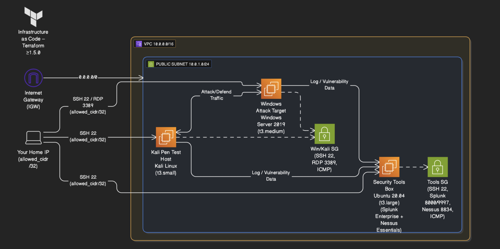

# AWS Cybersecurity Homelab for Real-Time Monitoring

[](https://www.terraform.io/) [](https://aws.amazon.com/) [](https://www.kali.org/) [](https://www.splunk.com/) [](https://www.tenable.com/)

AWS-based attack/defend cybersecurity homelab with Kali Linux, Windows Server 2019, Splunk Enterprise, and Nessus Essentials, fully automated with Terraform.

---

## Quickstart (For Experienced Users)

```bash
# 1. Clone repo and enter terraform folder
git clone https://github.com/r-ramos2/scalable-aws-cybersecurity-lab-for-real-time-monitoring-and-vulnerability-management.git
cd scalable-aws-cybersecurity-lab-for-real-time-monitoring-and-vulnerability-management/terraform

# 2. Configure your IP
cp terraform.tfvars.example terraform.tfvars
# edit terraform.tfvars → set allowed_cidr = "YOUR_PUBLIC_IP/32"

# 3. Deploy infrastructure
terraform init
terraform apply -auto-approve

# 4. Connect to instances
# Kali:    ssh -i ./deployer_key.pem kali@$(terraform output -raw kali_public_ip)
# Tools:   ssh -i ./deployer_key.pem ubuntu@$(terraform output -raw tools_public_ip)
# Windows: Retrieve password and RDP (see outputs)

# 5. Access security tools
# Splunk:  http://$(terraform output -raw tools_public_ip):8000
# Nessus:  https://$(terraform output -raw tools_public_ip):8834
````

---

## Table of Contents

1. [Topology](#topology)
2. [Architecture Overview](#architecture-overview)
3. [Prerequisites](#prerequisites)
4. [Repository Structure](#repository-structure)
5. [Getting Started](#getting-started)
6. [Instance Configuration](#instance-configuration)
7. [Security Tools Setup](#security-tools-setup)
8. [Running Security Operations](#running-security-operations)
9. [Cleanup](#cleanup)
10. [Best Practices](#best-practices)
11. [Security Considerations](#security-considerations)
12. [Troubleshooting](#troubleshooting)
13. [Next Steps & Enhancements](#next-steps--enhancements)
14. [Resources](#resources)

---

## Topology



Single public VPC with three EC2 hosts (Kali, Windows, Tools) in a public subnet, each secured by dedicated security groups.

---

## Getting Started

### 1. Clone the repository

```bash
git clone https://github.com/r-ramos2/scalable-aws-cybersecurity-lab-for-real-time-monitoring-and-vulnerability-management.git
cd scalable-aws-cybersecurity-lab-for-real-time-monitoring-and-vulnerability-management/terraform
```

### 2. Configure variables & authentication

**Important:** Terraform auto-generates an RSA keypair and saves it as `deployer_key.pem`. Back up any existing file with this name before proceeding.

Create your configuration file:

```bash
cp terraform.tfvars.example terraform.tfvars
```

Edit `terraform.tfvars` and set your public IP:

```hcl
# Required: Your current public IP (find with: curl ifconfig.me)
allowed_cidr = "203.0.113.25/32"  # REPLACE with YOUR_PUBLIC_IP/32

# Optional: Override instance types for cost optimization
# kali_instance_type    = "t3.micro"   # Minimum for basic testing
# windows_instance_type = "t3.small"   # Reduce Windows costs
# tools_instance_type   = "t3.medium"  # Reduce tools server costs
```

**Do not use RFC-5737 documentation addresses (203.0.113.x) in production.**

### 3. Provision infrastructure

```bash
# Initialize Terraform and download providers
terraform init

# Validate configuration syntax
terraform validate

# Preview infrastructure changes
terraform plan -out=plan.tfplan

# Apply the plan (creates AWS resources)
terraform apply plan.tfplan
```

Outputs:

* SSH private key location
* Public IPs for all instances
* Pre-formatted SSH and RDP commands
* Service URLs for Splunk and Nessus
* Windows password retrieval command

Save these outputs:

```bash
terraform output > lab_info.txt
```

---

## Instance Configuration

### Kali Linux (Attacker Machine)

**Connect via SSH:**

```bash
ssh -i ./deployer_key.pem kali@$(terraform output -raw kali_public_ip)
```

**Connect via RDP (XFCE Desktop):**

```bash
# Using FreeRDP (Linux/macOS)
xfreerdp /u:kali /v:$(terraform output -raw kali_public_ip):3389 /cert:ignore

# Using Microsoft Remote Desktop (Windows/macOS)
# Connect to: kali_public_ip:3389
# Username: kali
# Password: kali
```

> **Note on Clipboard:** Clipboard redirection is disabled by default for security. If you need clipboard access between your local machine and Kali, SSH to the instance and run:
>
> ```bash
> sudo sed -i 's/clipboard=0/clipboard=1/g' /etc/xrdp/xrdp.ini
> sudo systemctl restart xrdp
> ```
>
> Then reconnect via RDP.

**Verification:**

```bash
# Check XRDP status
sudo systemctl status xrdp

# Verify Kali tools installation
which nmap metasploit sqlmap nikto
```

**Bootstrap logs:** `/var/log/cloud-init-output.log`

The bootstrap script automatically installs:

* XFCE desktop environment
* XRDP server for remote desktop access
* Essential Kali penetration testing tools

### Windows Server 2019 (Target Machine)

**Retrieve Administrator password:**

Wait 4-5 minutes after instance launch, then run:

```bash
# From your local machine (requires AWS CLI)
aws ec2 get-password-data \
  --instance-id $(terraform output -raw windows_instance_id) \
  --priv-launch-key ./deployer_key.pem \
  --query 'PasswordData' \
  --output text | base64 -d
```

Or use the AWS Console:

1. Navigate to EC2 → Instances
2. Select the Windows instance
3. Actions → Security → Get Windows Password
4. Upload `deployer_key.pem`

**Connect via RDP:**

```bash
# Windows/macOS: Use Microsoft Remote Desktop
# Connect to: windows_public_ip:3389
# Username: Administrator
# Password: (from command above)

# Linux: Use Remmina or FreeRDP
remmina -c rdp://Administrator@$(terraform output -raw windows_public_ip)
```

**Post-connection setup:**

1. Disable Windows Firewall (for testing only):

   ```powershell
   Set-NetFirewallProfile -Profile Domain,Public,Private -Enabled False
   ```

2. Install Splunk Universal Forwarder:

   * Download from: [https://www.splunk.com/en_us/download/universal-forwarder.html](https://www.splunk.com/en_us/download/universal-forwarder.html)
   * Install to: `C:\Program Files\SplunkUniversalForwarder`
   * Configure forwarding to Tools server IP on port 9997

3. Enable Windows Event Logging:

   ```powershell
   wevtutil sl Security /e:true
   wevtutil sl Application /e:true
   wevtutil sl System /e:true
   ```

### Security Tools Box (Ubuntu)

**Connect via SSH:**

```bash
ssh -i ./deployer_key.pem ubuntu@$(terraform output -raw tools_public_ip)
```

**Verification:**

```bash
# Check system resources
free -h
df -h
top
```

The tools instance requires manual installation of Splunk and Nessus (see next section).

---

## Security Tools Setup

### Splunk Enterprise

**1. Install Splunk:**

> **Important:** Set a secure admin password before running the installation script:
>
> ```bash
> export SPLUNK_ADMIN_PASS='YourSecureP@ssw0rd!'
> ```
>
> Password requirements: minimum 8 characters with uppercase, lowercase, number, and special character.

```bash
# SSH to tools instance
ssh -i ./deployer_key.pem ubuntu@$(terraform output -raw tools_public_ip)

# Change to home directory
cd ~

# Download Splunk (version may change * check splunk.com)
wget -O splunk.deb "https://download.splunk.com/products/splunk/releases/9.1.0/linux/splunk-9.1.0-1c86ca0bacc3-linux-2.6-amd64.deb"

# Install package
sudo dpkg -i splunk.deb

# Start Splunk and accept license
sudo /opt/splunk/bin/splunk start --accept-license --answer-yes

# Enable boot-start
sudo /opt/splunk/bin/splunk enable boot-start -user splunk
```

**2. Configure Splunk:**

Access Splunk Web UI: `http://<TOOLS_PUBLIC_IP>:8000`

Default credentials on first login will be set from the installer or must be changed immediately.

**3. Enable receiving from forwarders:**

```bash
# On tools instance
/opt/splunk/bin/splunk enable listen 9997 -auth admin:your_password

# Restart Splunk
/opt/splunk/bin/splunk restart
```

**4. Create indexes for Windows logs:**

In Splunk Web UI:

1. Settings → Indexes → New Index
2. Create index: `win_security`
3. Set data type: Event
4. Save

**5. Configure Windows Forwarder:**

On Windows instance, edit:
`C:\Program Files\SplunkUniversalForwarder\etc\system\local\inputs.conf`

Add:

```ini
[default]
host = WIN10-WORKSTATION

[WinEventLog://Security]
sourcetype = WinEventLog:Security
index = win_security
disabled = false

[WinEventLog://Application]
sourcetype = WinEventLog:Application
index = win_security
disabled = false

[WinEventLog://System]
sourcetype = WinEventLog:System
index = win_security
disabled = false
```

Edit `outputs.conf`:

```ini
[tcpout]
defaultGroup = default-autolb-group

[tcpout:default-autolb-group]
server = <TOOLS_PRIVATE_IP>:9997

[tcpout-server://<TOOLS_PRIVATE_IP>:9997]
```

Restart Splunk Universal Forwarder service.

### Tenable Nessus


Essentials

**1. Register for Nessus Essentials:**

Visit: [https://www.tenable.com/products/nessus/nessus-essentials](https://www.tenable.com/products/nessus/nessus-essentials)

Register and obtain activation code (free for home use, scans up to 16 IPs).

**2. Install Nessus:**

```bash
# SSH to tools instance
ssh -i ./deployer_key.pem ubuntu@$(terraform output -raw tools_public_ip)

# Run installation script
cd ~
bash ../scripts/nessus_install.sh
```

Or manually:

```bash
# Download Nessus package
wget -O Nessus-10.3.0-debian6_amd64.deb "https://www.tenable.com/downloads/api/v2/pages/nessus/files/Nessus-10.3.0-debian6_amd64.deb"

# Install package
sudo dpkg -i Nessus-10.3.0-debian6_amd64.deb

# Start Nessus service
sudo systemctl enable --now nessusd
```

**3. Configure Nessus:**

Access Nessus Web UI: `https://<TOOLS_PUBLIC_IP>:8834`

Initial setup:

1. Accept the SSL warning (self-signed certificate)
2. Choose "Nessus Essentials"
3. Enter activation code from registration
4. Create admin user credentials
5. Wait for plugin updates (15-30 minutes)

**4. Add scan targets:**

1. Create new scan → Basic Network Scan
2. Add targets:

   * Kali Linux IP (private IP from VPC)
   * Windows Server IP (private IP from VPC)
3. Configure scan schedule (optional)
4. Launch scan

---

## Running Security Operations

### Attack Simulation (From Kali)

**1. Network reconnaissance:**

```bash
# Ping sweep
nmap -sn 10.0.1.0/24

# Port scan Windows target
nmap -sV -p- <windows_private_ip>

# Service enumeration
nmap -sC -sV <windows_private_ip>
```

**2. Vulnerability scanning:**

```bash
# SMB enumeration
enum4linux -a <windows_private_ip>

# Web application scanning (if IIS installed)
nikto -h http://<windows_private_ip>
```

**3. Exploitation (controlled environment only):**

```bash
# Metasploit Framework
msfconsole

# Search for exploits
msf6 > search type:exploit platform:windows
```

### Monitoring & Detection (In Splunk)

**1. View incoming logs:**

```spl
index=win_security
| stats count by sourcetype, host
```

**2. Detect RDP logins:**

```spl
index=win_security EventCode=4624 Logon_Type=10
| table _time, User, Source_Network_Address
```

**3. Monitor failed login attempts:**

```spl
index=win_security EventCode=4625
| stats count by Account_Name, Source_Network_Address
| where count > 5
```

**4. Detect suspicious processes:**

```spl
index=win_security EventCode=4688
| stats count by New_Process_Name
| sort -count
```

**5. Create alerts:**

Settings → Searches, reports, and alerts → New Alert

Example: Alert on 5+ failed logins in 5 minutes.

### Vulnerability Management (In Nessus)

**1. Review scan results:**

* Navigate to Scans → Select completed scan
* Review vulnerabilities by severity: Critical, High, Medium, Low, Info

**2. Prioritize remediation:**

Focus on:
* Critical vulnerabilities with high CVSS scores
* Vulnerabilities with public exploits available
* Services exposed to the internet

**3. Export reports:**

* Select scan → Export
* Choose format: PDF, HTML, CSV
* Share with stakeholders

**4. Track remediation:**

* Re-scan after applying patches
* Compare historical scan results
* Document remediation efforts

---

## Cleanup

**Destroy all AWS resources:**

```bash
cd terraform
terraform destroy -auto-approve
```

**Verify deletion:**

```bash
# Check for remaining resources
aws ec2 describe-instances --filters "Name=tag:Project,Values=aws-cybersecurity-homelab"

# Check for remaining volumes
aws ec2 describe-volumes --filters "Name=tag:Project,Values=aws-cybersecurity-homelab"
```

**Important:** The `deployer_key.pem` file remains on disk after `terraform destroy`. Delete manually if no longer needed:

```bash
rm -f ./deployer_key.pem
```

---

## Best Practices

**Infrastructure Management:**
* Use remote state (S3 + DynamoDB) for collaboration
* Tag all resources for cost tracking
* Apply least-privilege IAM roles
* Enable CloudTrail for audit logging
* Set AWS billing alerts

**Security Hygiene:**
* Rotate SSH keys every 90 days
* Change default passwords immediately
* Restrict security group ingress to your IP only
* Never use 0.0.0.0/0 in security groups
* Enable MFA on root and IAM accounts

**Cost Optimization:**
* Run `terraform destroy` when not actively using the lab
* Use t3.micro/t3.small for lightweight workloads
* Consider spot instances for savings
* Schedule auto-shutdown during idle hours
* Track spend with AWS Cost Explorer

**Operational Excellence:**
* Document all configurations
* Version-control infrastructure code
* Test backup and recovery regularly
* Maintain separate dev/prod environments
* Automate snapshots and data protection

---

## Security Considerations

This homelab uses a single public subnet for simplicity and cost efficiency. All instances have public IPs but restrict ingress to the admin IP only. It is intended for controlled, educational testing rather than production use. Never expose production systems without applying the hardening steps below.

**For production, apply these hardening steps:**

* Move workloads to private subnets behind a bastion or VPN
* Use a NAT Gateway for outbound internet access
* Replace SSH with SSM Session Manager
* Attach IAM roles to EC2s instead of static keys
* Protect services with ALB + TLS (ACM) and WAF
* Enable GuardDuty, Inspector, and Security Hub
* Capture full logs: VPC Flow Logs, CloudTrail, CloudWatch
* Encrypt with KMS, S3 policies, and EBS encryption
* Patch with SSM Patch Manager or scheduled scans
* Enforce least-privilege IAM policies and regular audits

---

## Next Steps & Enhancements

* Add IAM roles for all EC2 instances
* Automate tool installation and checksum verification
* Configure remote Terraform backend (S3 + DynamoDB)
* Add CloudWatch metrics, alarms, and dashboards
* Schedule automated EBS snapshots

---

## Resources

* [AWS Documentation](https://aws.amazon.com/documentation/)
* [Terraform Documentation](https://www.terraform.io/docs)
* [Splunk Documentation](https://docs.splunk.com/)
* [Nessus Documentation](https://docs.tenable.com/nessus/)
* [Kali Linux Tools](https://www.kali.org/tools/)
